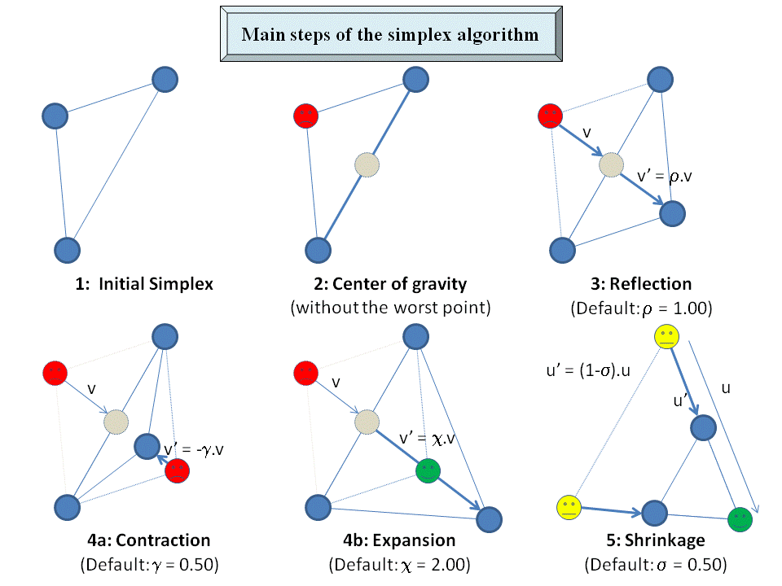
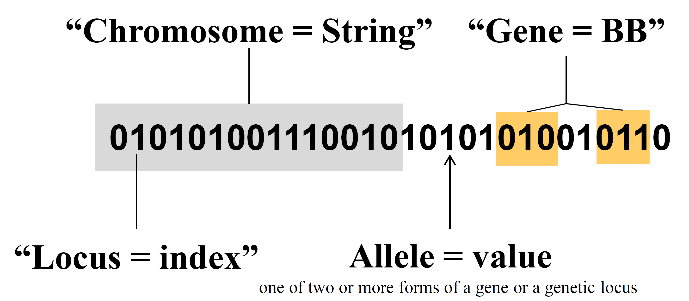
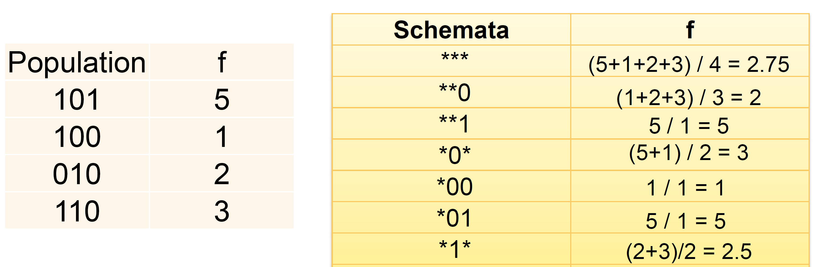
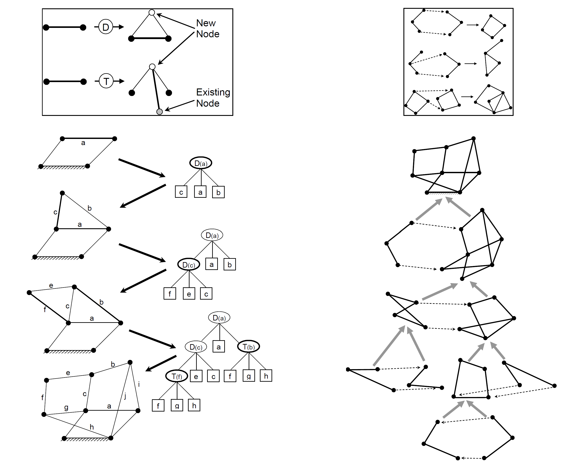
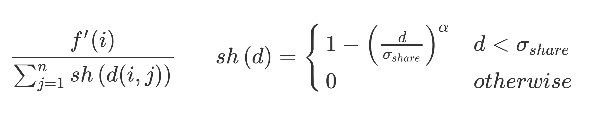

# Review for Evolutionary computation

 Note: All reference from Hod's slides if not specified

### Difference between direct and indirect encoding

+ direct encoding: one gene for every DOF
+ indirect encoding:  evolves rules, more compact

### In which case use parametric

+ simpler problems, GA overkill
+ baseline, comparison/diagnostics
+ "inner loop" of GA

### In which case use use EA

+ not too simple (e.g. convex problem with gradient)
+ not too hard (e.g. needle in the haystack)
+ problem with substructure (sub-components that are sub solution to sub problems)

### When is random search best for

+ needle in the haystack
+ deceptive gradient

### Hierarchical search (how to)

 1. sample n random points
 2. rank top m points
 3. sample a new point within the convex hull of the m points
 4. repeat from 2

### Simplex algorithm (how to)

+ reflection/contraction/expansion/shrinkage
+ reflect the point win the highest objective function through centroid of the remaining simplex
+ best point? Expansion
+ good point? Reflection
+ worst point? Shrinkage

ref:[capsis](http://capsis.cirad.fr/capsis/documentation/optimisation)

### Simulated annealing (how to)

- Let  $s =  s_0$
- For  $k  = 0$  to $k_{max}$:
  - $T = temperature((k+1)/k_{max})$
  - Pick a random neighbour,  $s_{new} = neighbour(s)$
  - If  $e^{(f(s_{new})- f(s))/T} >= random(0,1):$
    - $s←  s_{new}$
- Output: the final state  s

[link](https://en.wikipedia.org/wiki/Simulated_annealing)

### beam search (how to)

+ generation->mutate->combine and rank->down select->repeat

### GA variation operator

+ mutation
+ crossover: split and recombine parts from two individuals
+ composition: concatenate two individuals

### Why GA works

+ implicit parallelism (building block hypothesis)
+ GA implicitly identify and recombine "building blocks". i.e. low order, low defining-length schemata with above average fitness

### Building Block Hypothesis

+ GA solutions are composed of building blocks that contain useful genes
+ evolution recombines good building blocks.
+ Schemata with a low order and a short defining length are called building blocks

### Situations when crossover does not work

+ building blocks destroyed by crossover: e.g. uniform crossover
+ bad representation: loose linkage

### Why effective recombination is critical in GA

+ building block inside the genome are competing
+ GA works if representation and variation operator allow effective recombination of building blocks

### Representation for TSP

+ list of indices
+ priority encoding
+ connectivity matrix

### Speciation

related individuals that are able to breed among themselves, but are not able to breed with members of another species

### Can allopatric &sympatric speciation occur in the TSP problem

+ Allopatric speciation: physical separation (different geographical area) of a population, e.g., evolve TSP in islands
+ sympatric speciation: (same geographic area) reproductive/behavioral separation. e.g. the same solution with reversed order

### GA Selection methods

+ fitness proportionate:
  + roulette wheel
  + UCS ([Stochastic universal sampling](https://en.wikipedia.org/wiki/Stochastic_universal_sampling))
+ rank based:
  + truncation:top k% are replicated and replace bottom 100-k% with variation
  + tournament: Select random k, among those select top for variation
  + $(\mu,\lambda)$ generates $\lambda$ new offspring and uses top $\mu$ to populate the next generation
  + Elitism: Keep the best k solutions around unmodified
+ steady state selection
+ truncation selection

### steady state selection

1. Choose parent(s) at random
2. create offspring
3. Choose someone in population
4. If child better than selected individual, replace it

Beware: Produces races on multiprocessor architectures

### Premature convergence (cause & how to combat)

+ selection pressure too high, diversity lost
+ diversity maintenance, increase population size, lower selection pressure

### GA parameters (list)

+ selection pressure
+ crossover probability
+ mutation probability
+ population size
...

### Genetic drift

+ The change in the frequency of an existing variant (allele) in the population due to random sampling

The role of mutation and crossover in GA:

+ mutation: incremental progress, refinement
+ crossover: recombination of building blocks, discovering new areas (initially possibly inferior)

### Allele

+ one of two or more forms of the gene or genetic locus

### Order of a schema (definition)

+ num of specified alleles in a gene

### How many different strings of length N does a schema of order "o" represent

+ $2^{N-o}$

| Schema | Order | Represented Strings             |
|--------|-------|---------------------------------|
| ***    | 0     | 000 001 010 011 100 101 110 111 |
| \*1\*  | 1     | 010 011 110 111                 |
| *10    | 2     | 010 110                         |
| 101    | 3     | 101                             |

### Probability of a schema H of order o(H) surviving mutation

$$S_m(H) = (1-p_m)^{o(H)}$$

+ $p_m$ is the probability of mutating any bit.
+ schemata with higher order have a higher probability of being disrupted by mutation

### Probability of a schema H with defining length d(H) surviving single point crossover

$$S_c(H)>=1-p_c(d(H)/(l-1))$$

+ $p_c$ = crossover probability,
+ $l$ = length of the bit string in the search space
+ d(H) = distance between the furthest two non-* symbols, e.g d(\*10\*)=1, d(\*1\*0\*)=2,

+ -1 gives lower bound
+ schemata with a long defining length have a higher probability to be disrupted by crossover

### How many schemata could a string of length N possibly include

+ 1,0,*
+ $3^N$

### How many schemata in a population

+ Suppose p individuals of length N
+ between $2^N$ and $min(P2^N,3^N)$

### Estimating fitness associated with a gene

### Linkage (definition and why it's important)

+ genetic proximity of functionally related genes
+ loose linkage->good building blocks cannot be promoted
+ light linkage->evolvability (potential to keep improving)

### Linkage (How to improve)

+ inversion: reorder the genes as we progress, orderings with tight linkage will prevail
+ evolve crossover point: introns/probabilities/junk DNA
+ infer directly and decouple: linkage learning

### Trait/pleiotropy/polygeny/epistasis

+ trait: phenotypic characteristic
+ pleiotropy: one gene might affect several traits
+ polygeney: one trait might be affected by several genes
+ epistasis: genetic interaction, when the action of one gene is modified by one or more other independent genes
  + Supergenes: turn other genes on and off

### Steady State selection (how to)

+ choose parent at random
+ create offspring
+ choose someone  in population
+ if child better than selected individual replace it

### rank selection v.s. roulette wheel selection

+ roulette wheel selection may suffer from premature convergence
+ rank selection may not perform well due to small variations in large fitness

### Combating signal to noise issue in selection

+ normalization:
  + gaussian: subtract mean, divide by std
  + linear: bring min-max to [0,1]
  + nonlinear: boltzman selection F=exp(f/T)

### Genetic algorithm vs. Genetic programming

+ strings v.s trees (open-ended representation)
+ alleles v.s building blocks
+ GP has variable linkage, crossover is hierarchical

### Variational operator in symbolic regression

+ mutation (small, random)
  + change coefficient
  + replace branch with constant
+ crossover (large, non-random)
  + swap sub-trees

### How to represent the symbolic expression

+ heap data structure
  + element k has children 2k+1 and 2k+2 (zero indexed)

### How to evaluate symbolic tree (heap)

+ evaluate at the bottom and work way up
  + replace variables with values
  + replace operator with the result of the operation

### GP bloat

+ solutions get unnecessarily large but do not add any meaningful content. e.g. F(x)=x+x-x
+ combated using operator that reduce the size of the solution: pruning/snipping.

### Simplify symbolic tree

+ snipping: replace a sub-branch with a constant (average)
+ pruning: eliminate sub-branches with relatively low contribution

### evolve electronic circuit

+ parallel/serial/r/l/c...

### evolve straight line mechanism

+ variational operator should keep the DOF the same
+ start from a four-bar mechanism
+ T operator replaces a given link with two links that pass through a newly created node. The new node is also connected to another existing node
+ D operator creates a new node and connects it to both the endpoints of a given link, forming a rigid triangle component
+ ref: [How to Draw a Straight Line Using a GP by Hod](http://www.human-competitive.org/sites/default/files/lipson-paper.pdf)

### Coevolution (definition)

+ single/multiple populations where the relative ranking among two individuals depends on a third individual. E.g., chess against a co-evolving partner, takes care of the gradient problem
+ Collusion: e.g. bad simulator scores high for bad simulated robot

### Why coevolution

+ large (infinite) search space
+ no objective measures exist
+ objective measures difficult to formalize/unknown
+ certain types of structure in search space

### Types of coevolution

+ body-brain / morphography-controller
+ Antogonistic: predator-prey
+ Cooperative: symbiosis
+ Asymmetric: teacher-learner, host-parasite
+ the "extreme" form: symbiogenesis, where independent sybiont merge into single individual (reproduce together only) e.g. mitochondrial symbiogenisys

### Objective vs. subjective fitness  

+ Objective: Ground truth
+ Subjective: Fitness as measured using co-evolving  
metric

### How to use coevolution on symbolic regression

+ expression trees and data-points both subject to mutation and crossover

### Coevolution issues

+ subjective fitness can be
  + misleading progress
  + cycles of forgetting
  + collusion

### Cooperation issues

+ joint fitness may lead to "hitchhikers."
+ credit assignment problem

### Red Queen effect in coevolution

+ "it takes all the running you can do, to keep in the same place"
+ one population's progress is is assessed using another population. relative progress matters.

### How to apply coevolution to TSP

+ divide and conquer
+ fitness of combined sub-solution depends on the overall distance
+ ref: How to Solve It: Modern Heuristics (p425)

### Why diversity  

+ Make crossover effective  
    – Building block material  
    – Hold on to building blocks that are not currently used  
+ Find multiple optima,  
    – Including useful sub-optima  
+ Combat deceptive gradients

### Loss of diversity (reason)

+ High selection pressure  
+ Selection noise: drift causes convergence even in the absence of fitness pressure
+ Operator noise:  High mutation and crossover may lose solutions, or lose critical building blocks, so population converges on what’s left

### How to maintain diversity

#### Diversity Maintenance

+ fitness sharing: Fitness is divided by number of similar individuals
  
<!-- $$ \frac{f'(i)}{\sum_{j=1}^n sh\left(d(i,j) \right)} \;\;\;\;\;\; sh\left(d \right)=\begin{cases}1-\left(\frac{d}{\sigma_{share}}\right)^{\alpha} & d < \sigma_{share}\\0 & otherwise\end{cases}$$ -->

+ crowding: Replace individuals that are similar
  + Stochastically: The more similar, the more likely to be replaced
  + Deterministically: Similar parent is replaced. d(p1,c1)+d(p2,c2)<? d(p1,c2)+d(p2+c1)
+ Niching: evolve individual in spatial/topological niches; migrate occasionally between niches
+ sequential( temporal) niching: restart many times, flatten areas where previous optima were found

#### Diversity generation

+ Hierarchical Fair Competition
+ Age-Layered Population Structure ([link](http://citeseerx.ist.psu.edu/viewdoc/download?doi=10.1.1.338.4656&rep=rep1&type=pdf))
  + why? Random individuals unlikely to be selected

### Disadvantage of weighting for multi-objective optimization

+ weight unknown

### How to implement multi-objective optimization

+ Select based on distance from the Pareto front  
+ Thinning and sampling

### Non-dominated Sorting Genetic Algorithm-II  (NSGA-II)  

+ Select by Pareto-rank and Crowding distance  
+ Sort the population into a hierarchy of subpopulations based on the ordering of Pareto dominance.  
+ Evaluate similarity between members of each sub-group on the Pareto front  
+ The resulting groups and similarity measures are used to  
promote a diverse front of non-dominated solutions

### Examples of meta-objectives in EA

+ evolvability: age-pareto
+ simplicity
+ novelty/diversity
  + e.g.  max(corr(residual_errors_of_neareast_fitness_neighbor))
+ robustness/sensitivity
+ modularity
+ cost of manufacturing
+ ...

### Pareto Coevolution

+ Use other individuals as dimensions of multi-objective evolution
+ Evolve partial solutions
+ Keep a partial solution as long as there is no other  partial solution better than it in all contexts (component is best in at least one context)
